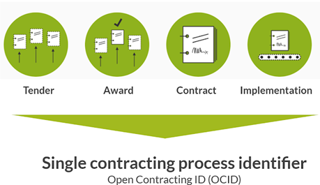

# How does OCDS work?
```{eval-rst}
.. admonition:: Objectives
   :class: note

   .. markdown::

The Open Contracting Data Standards (OCDS) is designed to support publishing data about contracting processes. This page exists to:

*   Show how a contracting process is represented using OCDS
*   Describe the formats for publishing OCDS
```
OCDS defines a unique contracting process as all the actions aimed at concluding one or more contracts. This covers tendering, awarding, contracting and implementation.

An individual contracting process has many different stages. We bring together the data published at each stage using a single contracting process identifier: the **OCID**.



Using an OCID means that users can easily join up data across the whole contracting process – a key feature and benefit of publishing and using OCDS data.

In designing OCDS, we explored a range of different user needs and use cases for data about public contracting. Each use case has different data needs in terms of data fields, documents, publication frequency, and data quality. OCDS provides a common framework to maximize the number of user needs that can be met through data and document disclosure.

The way OCDS does this, in addition to the OCID, is with its **schema**. The schema is documented in the [Reference](https://standard.open-contracting.org/latest/en/schema/) section. It sets out the fields, structure, data types and validation rules for OCDS data. The schema is described using JSON Schema, and the default format of the data is JSON (JavaScript Object Notation).

<div class="example hint" markdown=1>
<p class="first admonition-title">JSON vs. CSV</p>

While OCDS schema is described using JSON Schema, OCDS can also be published in CSV format. JSON is favored by developers because it uses human-readable text to exchange complex information, such as nested objects. It can contain large volumes of information and is particularly good at handling one-to-many relationships (such as multiple bids per tender notice).

CSV (or comma separated values) is a file format commonly used for spreadsheets. Many people are comfortable working with spreadsheets using tools like Excel. While JSON is the preferred format, a good publication will publish both so that more users' needs can be satisfied.

</div>

When mapping your data to OCDS, or when using OCDS data, you will encounter a number of common data structures, which are represented in the schema:

*   **release metadata** - contextual information about each release of data;
*   **parties** - information about the organizations and participants in the contracting process
*   **planning** - information about the goals, budgets and projects a contracting process relates to;
*   **tender** - information about how a tender will take place, or has taken place;
*   **awards** - information on awards made as part of a contracting process;
*   **contract** - information on contracts signed as part of a contracting process;
*   **implementation** - information on the progress of each contract towards completion.

Whichever format you choose, following OCDS rules and guidance will help you to:

*   Provide quality assurance checks to ensure the published data is in the correct structure and format and contains the required fields
*   Access a growing ecosystem of reusable tools and methodologies for working with OCDS data
*   Compare your data with other publishers’ data to examine value for money and other types of analysis

```{eval-rst}
.. admonition:: Learn More
   :class: note

   .. markdown::

To learn more, go to the next page in the primer: How is OCDS data published? You can also review the further resources below to go deeper into the subjects introduced on this page.

[Guidance to implementing OCDS](https://standard.open-contracting.org/latest/en/guidance/)
[Why implement OCDS](https://www.open-contracting.org/data-standard/)
[Open Contracting Playbook: Component 2](https://docs.google.com/document/d/1Y_sYOqUfdRdnvU6P8-aJFqWw9LaTNbbIPS0oJtmskCQ/edit#heading=h.44c3tmyw3edx)
```
